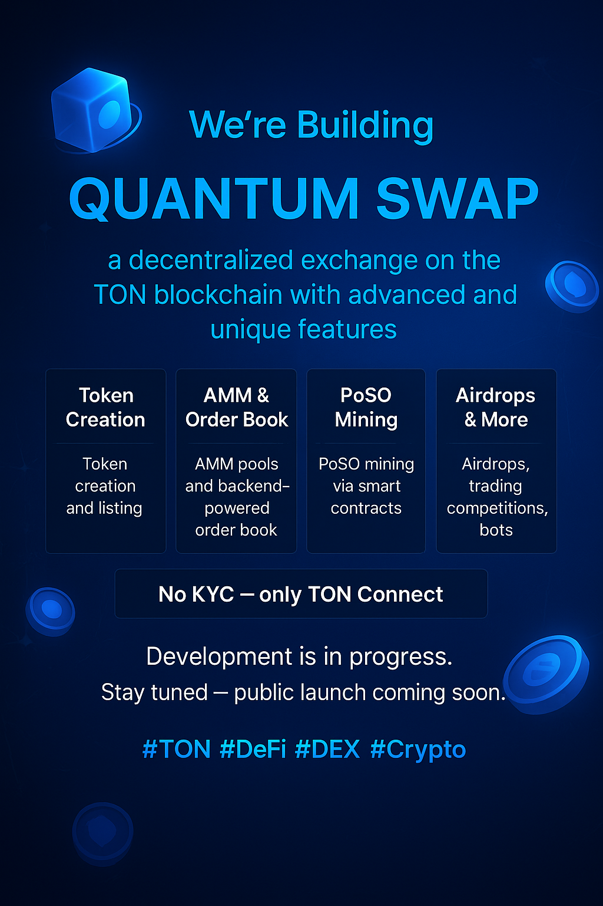

# Quantum Swap — Multifunctional DEX on TON

**Quantum Swap** is an innovative decentralized platform that combines the powerful features of centralized exchanges (CEX) with the privacy and convenience of Web3. All platform functionality is available without KYC — just connect your TON wallet (Tonkeeper, OpenMask, and others).

---

## 🚀 Project Status & Development Story

Quantum Swap is currently in active development. Both frontend and backend components are being continuously improved, tested, and expanded to bring the community the most robust, user-friendly, and feature-rich DEX experience in the TON ecosystem.

- **Frontend:**  
  We are focused on delivering a modern, intuitive, and mobile-friendly interface with seamless integration into TON wallets and the Telegram Mini App ecosystem.  
  Our team is actively adding new features, enhancing security, and polishing the user experience.

- **Backend & Smart Contracts:**  
  The backend and all smart contract logic are under intensive development and internal security audit.  
  We are building secure integrations with the TON blockchain, scalable APIs, and unique smart contract mechanisms such as PoSO Mining, advanced liquidity management, and cross-functional staking pools.

**Please note:**  
This repository contains only a **demo version** of the frontend. All features in this demo are implemented using mock data and placeholders.  
No real backend integrations, live blockchain operations, or business-critical algorithms are included in this public version for security and intellectual property protection.

---

## ⚡️ Platform Features (Planned & In Development)

- **Token Creation (Jetton Creator):**  
  Create your own token based on the Jetton (TON) standard, set the name, ticker, decimals, and deploy in one click.
- **Airdrop / Distribution:**  
  Mass token distribution, automatic fee calculation, transparent reporting of successful and failed transactions.
- **Trading:**  
  Swap interface, limit/market orders (Order Book), smart routing, price charts and history, support for multiple trading pairs.
- **Liquidity Pools:**  
  Create and manage pools, add/remove liquidity, and earn trading fees.
- **Staking:**  
  Multiple durations (7, 15, 30 days), automatic reward calculation, profitability calculator.
- **Trading Competitions:**  
  Organize contests with prize pools, automatic reward distribution.
- **Trading Bots:**  
  Flexible setup, support for various market-making strategies.
- **PoSO Mining:**  
  Buy virtual miners on smart contracts, generate tokens, halving, transparent statistics.
- **Telegram Mini-App:**  
  All Quantum Swap features are available through the Telegram Mini App — fast, convenient, and unrestricted.

---

## 🛠️ Roadmap Highlights

- **2024 Q2:**  
  - Core frontend demo and UI components
  - Mock integration with TON wallets and Telegram Mini App
- **2024 Q3:**  
  - Backend API launch (private beta)
  - Smart contracts for staking and pools (testnet phase)
- **2024 Q4:**  
  - Public testnet and smart contract audits
  - Full integration of trading, bots, and competitions
  - Initial mainnet deployment and public launch

---

## Important!

> **This repository contains only a demo version of the project. All features are implemented using mock data. The original business logic, integrations, smart contracts, and backend are in private development and are not published in open access.**

If you are a representative of a serious company, investor, or grant organization — please contact us to request access to the full project source code. We will review your application, and if this brings mutual benefits, we may provide access to the real source code or organize a private demonstration under NDA.

The backend and smart contracts are under active development and will be published for public review as soon as they are ready.

---

## Contacts

- [Telegram (Dev)](https://t.me/Vahe_Ar)
- [Telegram Channel](https://t.me/q_swap)
- [Twitter](https://x.com/QuantSwap)

---

**Thank you for your interest in Quantum Swap! Stay tuned for updates and the official launch.**
